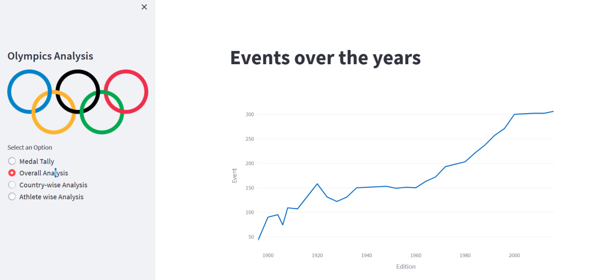
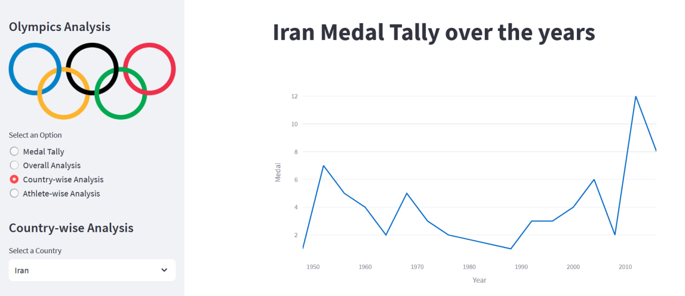

# Olympics Data Analysis
A web application to analyze the Olympics dataset from several views

[Dataset on kaggle](https://www.kaggle.com/datasets/heesoo37/120-years-of-olympic-history-athletes-and-results)

## First Analysis: Medal Tally
In this part, we analyze the performance of countries in each year. You can also select country and year.

## Second Analysis: Overall Analysis
In this part, we have an overall view

### Top statistics
* Editions 
* Hosts
* Events
* Athletes
* Nations
* Sports

### Analysis over time
* Participating Nations over the years
* Events over the years
* Athletes over the years
* No. of Events over time

### Most successful athletes
Most successful athletes in each sport 

## Third Analysis: Country-wise Analysis
In this part, we analyze thr performance of each country

* Medal Tally over the years
* Participation in sports over the year
* Top 10 athletes

## Fourth Analysis: Athlete-wise Analysis
In this part, we analyze all athletes
* Distribution of Age
* Distribution of Age wrt Sports
* Height Vs Weight
* Men Vs Women Participation Over the Years

